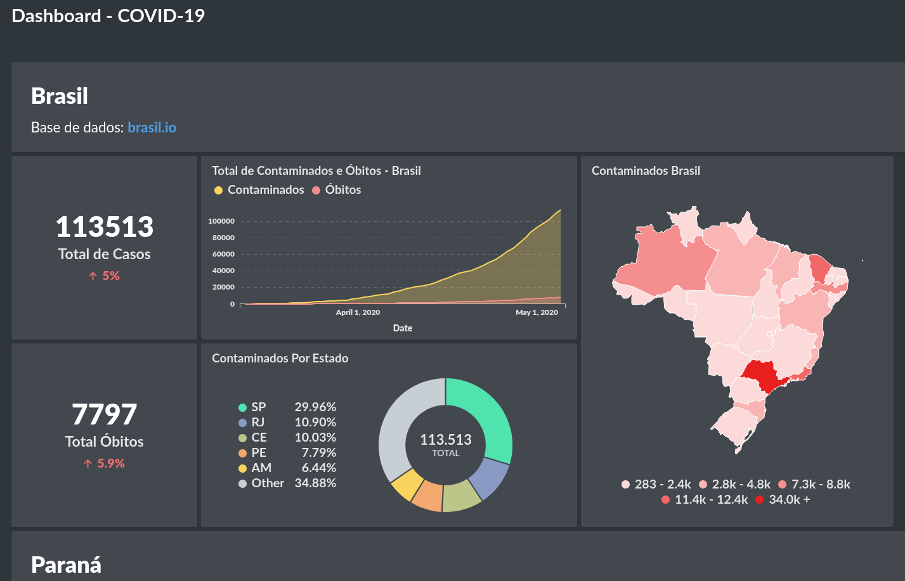

# COVID-19 Dashboard

Este projeto tem como próposito disponibilizar uma ferramenta de simples acesso aos dados de COVID-19 no Brasil. A opção pela ferramenta de visualização de dados [Metabase](https://www.metabase.com/start/) se dá pelo fato da simplicidade em formular "perguntas" em função do banco de dados.

## Requisitos
* Python3
    * requests
    * psycopg2
* PostgreSQL

## Como Usar

Criar table no bando de dados
```
$ sudo -i -u metabase psql
metabase=# CREATE DATABASE br_covid;
metabase=# GRANT ALL PRIVILEGES ON DATABASE br_covid TO metabase;
```

Rodar O ETL Script e informar a senha do Banco de Dados:
```bash
$ python3 etl.py
>> PostgreSQL Password: 
...
```
Pronto, os dados serão incluídos no bancos de dados.


## Configurando o Metabase

Baixe última versão do [Metabase](https://www.metabase.com/start/).

Execute a aplicação:

```bash
$ java -jar metabase.jar
```

Ao iniciar, configure o banco de dados em `Settings>Admin>databases`.

## Exemplo Dashboard



[Click aqui](http://45.76.59.111:3000/public/dashboard/b8d196d8-9468-4dc0-bd24-cb48b69a9dd4#theme=night) para o acessar o `dashboard`.

## Contribuições

Veja as intruções para contribuir com o projeto em CONTRIBUTING.md.


## Referências

* [Brasil.IO - Dados abertos para um Brasil mais ligado](https://github.com/turicas/brasil.io)
* [Metabase](https://www.metabase.com/start/)